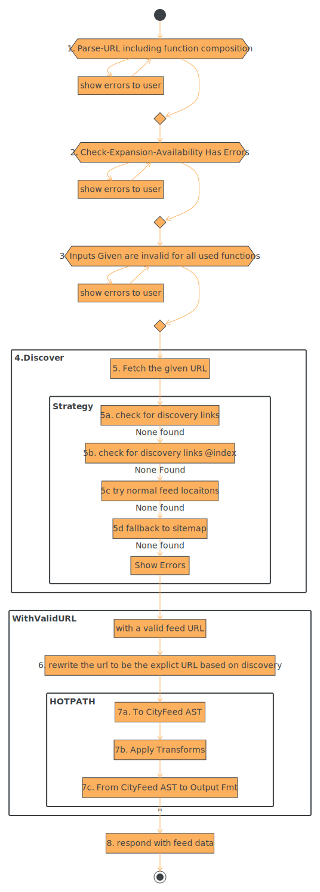

# Processing Pipeline Documnetation

<!--
- text-to-diagram source is in the .pintora file
- to change and re-render the SVG
- make changes in the .pintora file
- and then run:
```zsh
$> pintora render -i ./notes/pipeline.pintora -o ./notes/pipeline.svg`
```
-->



## 1. Parse-URL

URLs are route specific, however PARSING in this context usually means the
funciton compositions.

## 2. Check Expansion Availability

Since some configuration can be saved as a function token, make sure that
function tokens are expanded to their normal state, ensuring the user has
access, and making it available to check input validity.

## 3. Input Validation

- Each `FeedFix` application lists a jsonSchema URL for its validation schema.
- Applications are strongly urged to provid as many default values for users as
  possible.
- However should situations arise where a default can not be meaningfully
  provided, and user input is required - the json schema / ajv will be used to
  determine the validity of the input params

## 4. Discover Feed URL

Input URL -> Output Subscribable URLs to the user

### 5. Fetch Input URL

- Start by checking the URL given for any alternate links
  `<link rel='alternate' type='application/rss+xml' href="https://example.com/rss.xml"/>`

- Start by checking the URL given for any alternate links
- If none found, then try again with no path.
- if none found, move to `Usual Suspects`

### 5. Check Usual Suspects

- manipulate the path and fetch some normal places
- `/rss.xml`
- `/feed`
- `/posts/feed`
- ...etc

### 5. Check for Sitemap

- the sitemap is also a normal place to check - however its form is heavily
  trimmed down
- `/sitemap.xml`
- `/sitemap`
- `/index_sitemap.xml`

### 5. Give Up

- Nothing to subscribe to

## 6. Redirect to explicit with Config

## 7. Apply Transform Function Block

### 7a. To AST land

### 7b. Apply AST Transform Chain

### 7c. From AST to chosen fmt

## Optionally Save Feed Components

## 8. Return Transformed Feed
